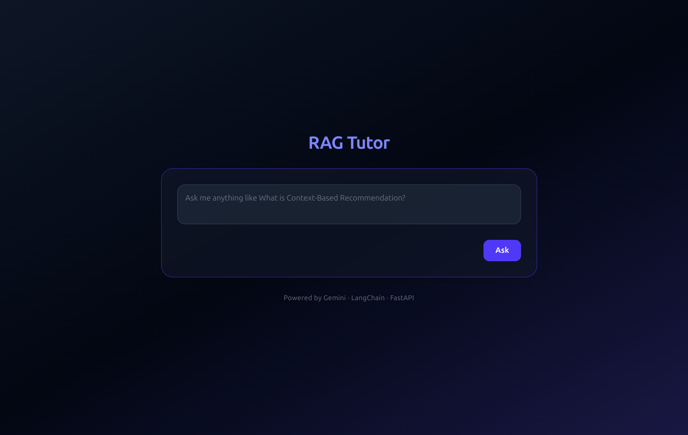
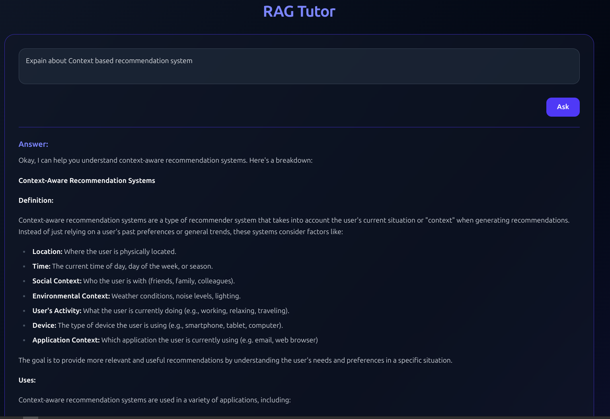
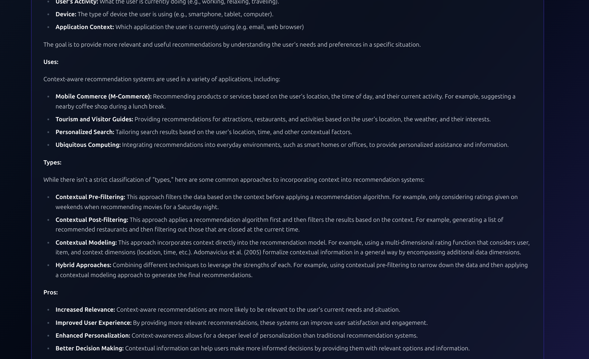

# RAG model with Gemini and PGVector

A Retrieval-Augmented Generation (RAG) prototype using Gemini embeddings, PostgreSQL vector store (PGVector), and LangChain. The system loads PDFs, embeds chunks, stores them, and supports question-answering via retrieval + generation.

---

# Output







---

## Features

- Load PDF documents and split them into chunks
- Compute embeddings (via Gemini or HuggingFace)
- Store embeddings and metadata in PostgreSQL using PGVector
- Build a retrieval + generation chain (RAG) using LangChain
- Ability to ask questions over the loaded documents
- Represents a minimal scaffold to extend further (e.g. add caching, streaming, memory)

---

## Architecture & How It Works

Here’s a high-level flow of operations:

1. **Document ingestion**

   - Use `PyPDFLoader` (from `langchain-community.document_loaders`) to load PDFs and extract page-level text.
   - Possibly split long pages or long texts into overlapping chunks (so that embeddings are more granular).

2. **Embedding generation**

   - Use a embeddings model (e.g. via `HuggingFaceEmbeddings` or a Gemini embedding API) to convert each text chunk into a vector representation.

3. **Storage**

   - Use **PGVector** (via `langchain_postgres.PGVector`) to store the embedding vectors, along with metadata (document id, chunk id, text content).
   - PostgreSQL serves as the vector database + relational metadata store.

4. **Retriever / Querying**

   - When a user submits a question, the system embeds the question, then queries the vector store (PGVector) for the top-k most similar document chunks (by vector similarity).
   - Retrieve those relevant document chunks.

5. **Generation / Answering**

   - Combine the retrieved chunks as “context” and pass them (with an LLM / prompt template) to generate the final answer.
   - Use a chain in LangChain (e.g. a “stuff” chain, or a more advanced chain) to combine the context and the question.

Thus, the “augmentation” is the retrieval of external knowledge (the documents) to ground the generation, rather than relying only on the language model's internal knowledge.

A simplified representation:

```
PDFs → chunks → embeddings → PGVector
User question → embed question → similarity search → top chunks → feed to LLM → answer
```

You already import `create_retrieval_chain`, `create_stuff_documents_chain`, and `ChatPromptTemplate`, so presumably your code wires up a LangChain pipeline of (retriever + generation) using a prompt template.

---

## Installation & Setup

Here’s a step-by-step guide for installing & running your project locally.

### Prerequisites

- Python 3.8 / 3.9 / 3.10 (or a version compatible with your dependencies)
- PostgreSQL instance with `pgvector` extension enabled
- Access / credentials for Gemini embedding / LLM API (if using Gemini)
- `git`

---

## Gemini API Key Setup

To use **Gemini embeddings or LLM**, you must set up your Gemini API key:

1. Go to the [Google AI Studio](https://aistudio.google.com/app/apikey) and sign in with your Google account.

2. Click **Create API key** to generate a new key.

3. Copy the key and store it in your `.env` file as:

   ```bash
   GEMINI_API_KEY=your_gemini_key_here
   ```

4. You can also export it directly in your terminal (for temporary sessions):

   ```bash
   export GEMINI_API_KEY=your_gemini_key_here
   ```

---

### Steps

1. **Clone the repository**

   ```bash
   git clone https://github.com/Esai-Keshav/rag-with-gemini-v1.git
   cd rag-with-gemini-v1
   ```

2. **Create a virtual environment (recommended)**

   ```bash
   python3 -m venv venv
   source venv/bin/activate   # on Linux / macOS
   # or `venv\Scripts\activate` on Windows
   ```

3. **Install dependencies**

   You should already have a `requirements.txt` :

   ```bash
   pip install -r requirements.txt
   ```

Flow:

- You load PDFs → chunk them → embed + store
- Query comes in → you retrieve top chunks
- Combine with prompt → send to LLM → answer

---

## Limitations & Future Work

- **Memory / context limits**: If documents are very large, combining all chunks may exceed model context window
- **Latency**: Embedding + retrieval + generation may take non-trivial time
- **Hallucination risk**: The LLM may still hallucinate beyond the retrieved context
- **No caching / incremental ingest**: You may want to add caching, incremental updates, or document versioning
- **Better chain types**: Rather than “stuff”, consider “map-reduce” or “refine” chains
- **Multi-modal support**: If PDFs include images / tables, you might support visual embedding + multimodal RAG
- **Scalability & vector DB choice**: For larger scale, consider Milvus, Weaviate, Pinecone instead of PGVector
- **Prompt tuning & fallback: in case no relevant chunks found**
